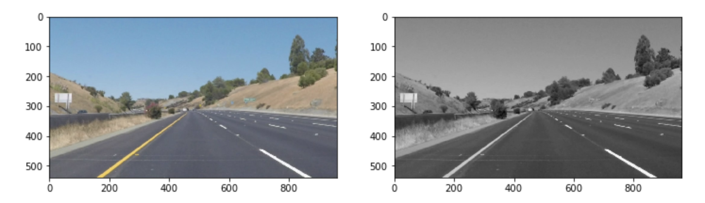
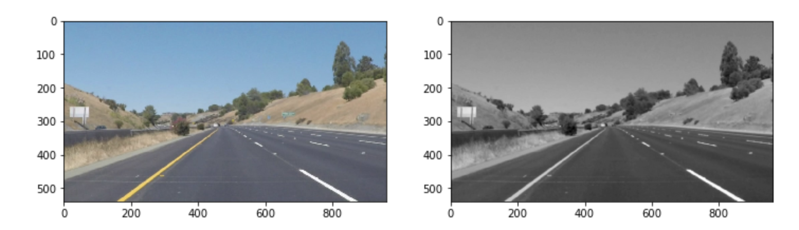
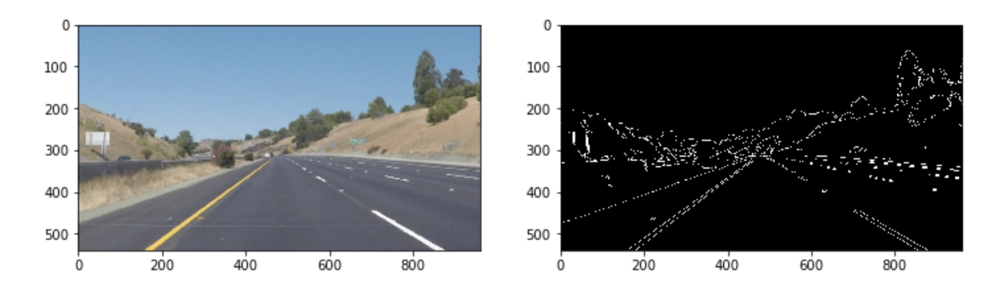
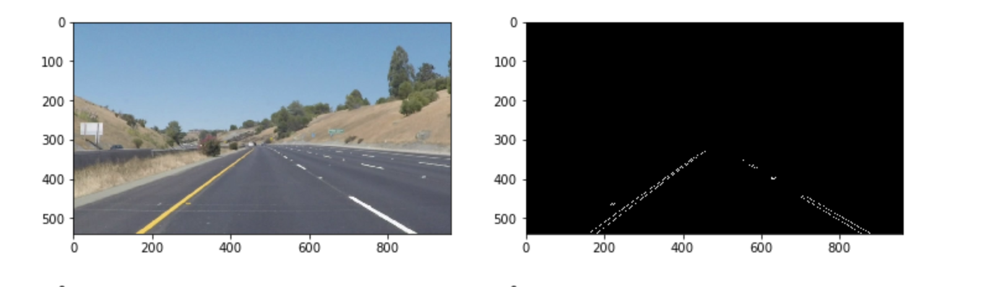
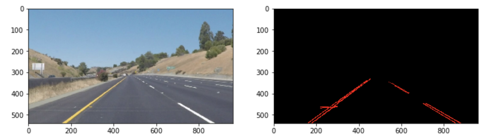
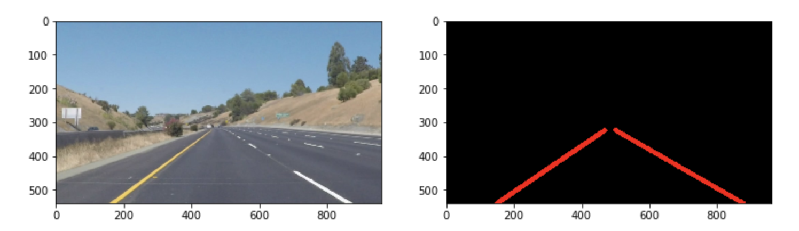
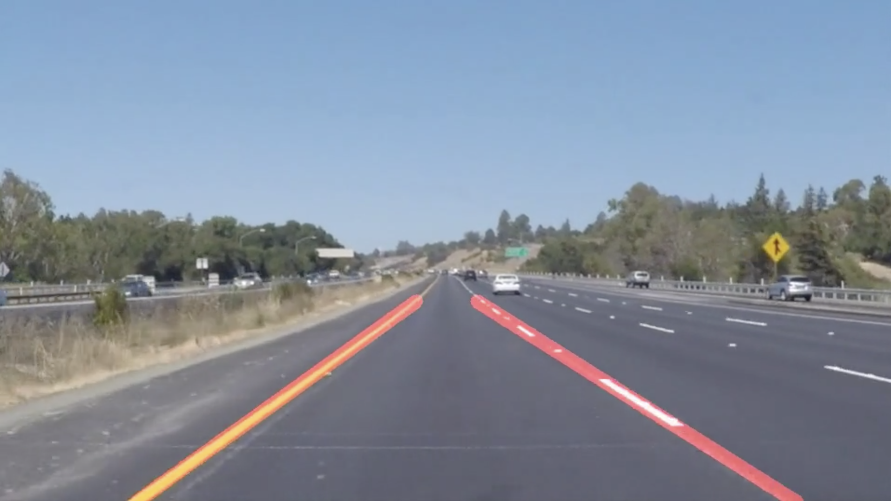
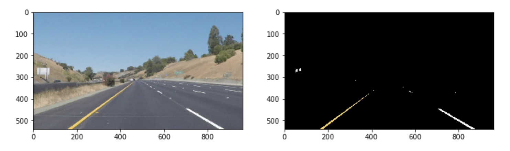

# **Reflection: Finding Lane Lines on the Road** 

## Describe your pipeline. As part of the description, explain how you modified the draw_lines() function.

My pipeline consisted of six steps.

1. I converted the image to grayscale to prepare the image for the next steps.

2. I applied a Gaussian Blur to the image to make edge detection more accurate.

3. I used Canny Edge Detection to produce an outline of all the edges discovered in the image.

4. Since the edge detection produced an image that also had street signs and other elements included, I applied a mask to retain only the lanes on the road.

5. I used Hough to outline the sets of lines identified in the edge detection.

6. From the set of lines, I extrapolated the full length left and right edges of the lane. (More on this below.)

At the end of the pipeline I created a composite image that resulted in the following lane outlines:

In order to draw a single line on the left and right lanes, I used the following logic to extrapolate the lane edge:
* For each line segment detected, I calculated the slope of that segment. Segments with negative slopes were categorized as left edges, segments with positive slopes as right edges. This produced two distinct lists of line segments.
    * I also excluded line segments with slopes outside of a reasonable range in order to cut out any possible outliers. 
* Within each of the new lists, I calculated the average slope and b-values of those segments to obtain the y=mx+b formula for each lane edge.
* Using the new formulas, I calculated the (x1, y1) and (x2, y2) endpoints for each edge. 
    * In these pairings I defined y1 as the y-position of bottom edge of the image. Then y2 was defined as the y-position 60% down the image to align itself with the top edge of the boundaries of the mask applied in the pipeline.
* With the endpoints defined I was able to connect them and draw the edges of each lane.

This pipeline also rendered proper results in a video loop:

However, in the challenge video my pipeline was not enough to accurately map the lanes onto the road. When the video approached a part of the road that was colored differently, the additional contrasting colors confused my pipeline and sent my lane edges to the opposite end of the screen.

To solve this I prepended a step to the pipeline. Before the grayscale conversion, I applied a Yellow-White mask to the image to only retain the parts of the image that are either yellow or white (colors of the lanes). This cut out other parts of the image that would have otherwise been perceived as lane edges.

This resulted in a better-performing pipeline in the challenge video that had more contrasts and edges.

## Identify potential shortcomings with your current pipeline

In the video output, my drawn lane lines are "shaky". With each new frame the edges move slightly because there is a slightly different slope calculated for that line each time. If a car was strictly adhering to these lines then it would be a horrible experience for the passengers since the car would be shaking left-and-right the entire time.

With lanes that are on very sharp turns, this lane-drawing logic would create dramatic lines that may not be accurate and may prematurely send the car angling off to the side in the direction of the turn.

Just like how contrasts in the road color presented a problem during the challenge video, darkness would also make this difficult (especially if the car does not have headlights on). The car would be unable to see the lines if it can't properly distinguish the colors in low-light scenarios.

## Suggest possible improvements to your pipeline

There may be better logic for extrapolating lane edges that would produce "smoother" lines in a video setting. Perhaps the extrapolation should also consider the past few frames of the video and perform a weighted average of the slope from the previous frames along with the current frame. This may stabilize the lane edges.

For very sharp turns and curves, the pipeline could apply a more narrow mask so that it only considers the line segments that are closest to the vehicle without angling the lane edges too far off into the direction of the sharp turn.

The vehicle may need several different vision modes to detect lane colors at different light levels. For example: a "Dark Mode" where the car knows to look for certain dark shades of gray and yellow to map out the correct lines on the road. In this case the pipeline would apply a different mask at the beginning (prior to grayscale).